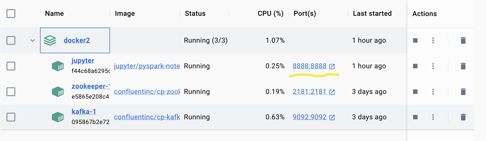
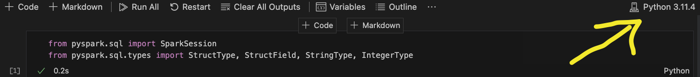
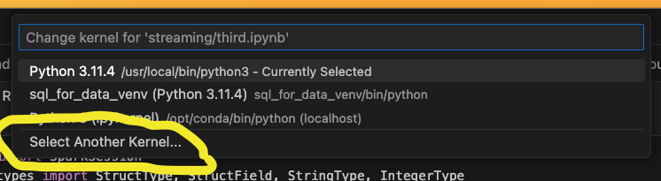
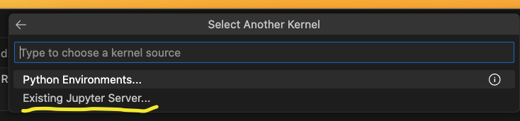

## Docker Compose

As per the previous modules, we will need to run a docker container before getting started in order for certain libraries to work.

A word of warning - Kafka, when you arrive at it, can be finickity and may need restarting.

## Container Up

- Now locally if you browse to this folder: `pills/stream_processing_docker`
- Run the command 
```console
docker compose up
 ```
That will download and launch everything in the scripts above. It takes a little while, so best to get it started now and then continue reading.

#### Virtual machines vs containers

For years we used virtual machine to quickly roll out servers or client machines. A virtual machine is
basically a computer with an operating system on it, but a virtual one, that you can download and run
on your current machine. They're generally not lightweight, because you have to download and install a whole operating system.

Now in recent years a more lightweight solution was invented containers. These differ by packaging software
rather than a whole operating system. These are generally used to quickly install whole ecosystems of
software that work together, these sit on top of the user operating system rather than using a
separate one.

Docker is the most popular container provider and below is an example of a docker compose script
that is about to be run on your machines to get this environment up and running:

```yaml
jupyter:
    image: jupyter/pyspark-notebook
    container_name: jupyter
    ports:
      - 8888:8888
    environment:
      - JUPYTER_TOKEN=easy
    volumes:
      - ./data:/home/jovyan/work
      # - ./data/kernel.json:/usr/local/share/jupyter/kernels/python3/kernel.json


  zookeeper:
    image: confluentinc/cp-zookeeper
    ports:
      - "2181:2181"
    environment:
      ZOOKEEPER_CLIENT_PORT: 2181

  kafka:
    image: confluentinc/cp-kafka
    ports:
      - "9092:9092"
    depends_on:
      - zookeeper
    environment:
      KAFKA_ZOOKEEPER_CONNECT: zookeeper:2181
      KAFKA_ADVERTISED_LISTENERS: PLAINTEXT://kafka:9092
      KAFKA_LISTENER_SECURITY_PROTOCOL_MAP: PLAINTEXT:PLAINTEXT
      KAFKA_INTER_BROKER_LISTENER_NAME: PLAINTEXT
      KAFKA_OFFSETS_TOPIC_REPLICATION_FACTOR: 1

volumes:
  notebooks:
  
```

Now keep the terminal open for the streaming module we'll be viewing the output there and diagnosing
any problems in the terminal output.

## VSCode Integration

We have been working in VSCode for quite a while now, and it would be nice to continue to do so.

In order for the Docker container versions of Kafka and Jupyter to work together we need to tell VSCode to look for the Jupyter Kernel that has been spun up by Docker.

In order to do that, make sure the Docker container is running, and follow these steps:

1. Start, or restart the Docker container. It includes Kafka and Jupyter. Notice that Jupyter is running on `port 8888`.


1. Select the Kernel button in your notebook. This is the button we used to select our virtual environment in previous modules.


1. Choose the option 'Select Another Kernel'.


1. Choose the option 'Existing Jupyter Server'.


1. Enter the URL of the Jupyter server. Remember Docker has it running on `port 8888`.


1. Choose the recommended version of python, and (possibly) enter the password. If required the password is `easy`. This is in the dockerfile should it change.

### Alternate Route

Should these steps not resolve your VSCode integration, you can always open the `Jupyter Lab` portal and IDE by going to:

`127.0.0.1:8888` **OR** `localhost:8888`

in your browser.

This is the direct link to the version of Jupyter running from the Docker container.

## Moving On

Once you have done this, move onto the Spark folder and work through those files.

[Link here](https://github.com/makersacademy/data_streaming/blob/main/01_spark/01_architecture.md)

<!-- BEGIN GENERATED SECTION DO NOT EDIT -->

---

**How was this resource?**  
[😫](https://airtable.com/shrUJ3t7KLMqVRFKR?prefill_Repository=makersacademy%2Fdata_streaming&prefill_File=00_introduction%2F02_docker_set_up.md&prefill_Sentiment=😫) [😕](https://airtable.com/shrUJ3t7KLMqVRFKR?prefill_Repository=makersacademy%2Fdata_streaming&prefill_File=00_introduction%2F02_docker_set_up.md&prefill_Sentiment=😕) [😐](https://airtable.com/shrUJ3t7KLMqVRFKR?prefill_Repository=makersacademy%2Fdata_streaming&prefill_File=00_introduction%2F02_docker_set_up.md&prefill_Sentiment=😐) [🙂](https://airtable.com/shrUJ3t7KLMqVRFKR?prefill_Repository=makersacademy%2Fdata_streaming&prefill_File=00_introduction%2F02_docker_set_up.md&prefill_Sentiment=🙂) [😀](https://airtable.com/shrUJ3t7KLMqVRFKR?prefill_Repository=makersacademy%2Fdata_streaming&prefill_File=00_introduction%2F02_docker_set_up.md&prefill_Sentiment=😀)  
Click an emoji to tell us.

<!-- END GENERATED SECTION DO NOT EDIT -->
