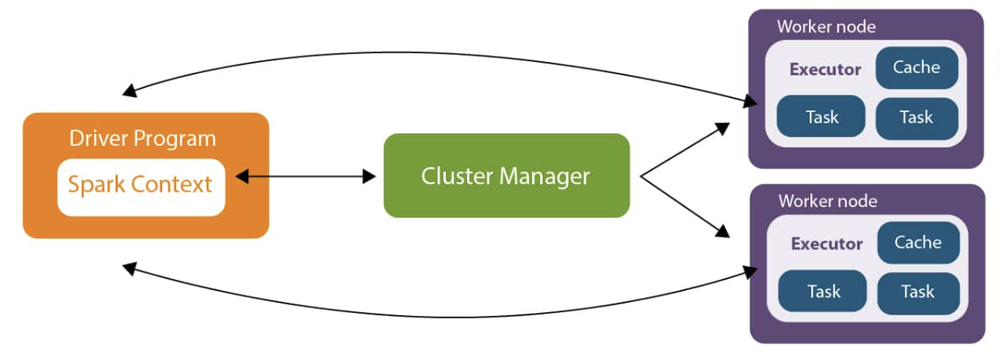

## What is Spark ?

Spark is a framework for processing massive amounts of data. It processes data in 
parallel by letting you interact with a cluster.
What this means in practice is this; imagine a program running on your
computer, it's running very slowly so you upgrade your computer, getting a bigger
more powerful one, at some point you're going to hit a point where you can't buy a bigger
computer to combat the size of the program and its data - the solution is rent cloud computers that run in parallel to process the events and data. That is what Spark is, essentially a bunch of computers all working together at the same time to run your program.

So what we've done in IT in recent years is to divide the work up and send it out to
multiple computers, distributing the workload between them. So yeah CPU just has
to process a smaller, easier amount of data, the more data the have, the more CPUs
you can add to your cluster.

The hardest parts of this approach is figuring out how to divide the data up, and how
to reassemble the answer once all the pieces come back to you.
Which is the power of Spark, you write the code to move and transform your data
and it takes care of the rest for you.

For the past few years Spark was the main way of moving and transforming data
at scale, recently cloud providers have created a native way to run Spark, Google cloud
calls in DataProc and Amazon web services you can use Glue, so if you see these mentioned
in the future they're probably talking about Spark under the hood.

___

### Architecture

Spark makes it so you don't have to worry about managing a cluster, you just write Spark
code and it takes care of the rest of it for you.
A few years ago you'd just have to worry about rolling out a Spark cluster
but now with the cloud that is also taken care of for you. But you will need to know 
what is going on under the hood in case you need to debug problems or look into 
performance problems.

Spark has a few basic components, the driver program where you submit your job
and it's the brain, the cluster manager that takes care of interacting with the
worker nodes, then the worker nodes themselves that then run your code 
and return the results to the Driver program.

- Cluster Manager: Spark can integrate with various cluster managers like Apache Mesos,
Hadoop YARN, and its standalone cluster manager. The cluster manager is responsible 
for allocating resources (CPU, memory) to Spark applications and managing the cluster's 
overall health.

- Driver Program: The driver program is the entry point of a Spark application. 
It runs the main function and coordinates the execution of tasks across the cluster. 
The driver program splits the application into smaller tasks and schedules them on the cluster.

- Executors: Executors are worker processes that run on cluster nodes. They are responsible 
for executing tasks assigned by the driver program. Executors manage the data storage and 
perform computations on the data. Each executor has a dedicated JVM and runs multiple tasks 
concurrently.

When writing Spark code you generally only have to thinking about the driver program and
the executors, the cluster manager generally doesn't come into the debugging or performance
investigation.

[Next Challenge](02_spark_api.md)

<!-- BEGIN GENERATED SECTION DO NOT EDIT -->

---

**How was this resource?**  
[😫](https://airtable.com/shrUJ3t7KLMqVRFKR?prefill_Repository=makersacademy%2Fdata_streaming&prefill_File=01_spark%2F01_architecture.md&prefill_Sentiment=😫) [😕](https://airtable.com/shrUJ3t7KLMqVRFKR?prefill_Repository=makersacademy%2Fdata_streaming&prefill_File=01_spark%2F01_architecture.md&prefill_Sentiment=😕) [😐](https://airtable.com/shrUJ3t7KLMqVRFKR?prefill_Repository=makersacademy%2Fdata_streaming&prefill_File=01_spark%2F01_architecture.md&prefill_Sentiment=😐) [🙂](https://airtable.com/shrUJ3t7KLMqVRFKR?prefill_Repository=makersacademy%2Fdata_streaming&prefill_File=01_spark%2F01_architecture.md&prefill_Sentiment=🙂) [😀](https://airtable.com/shrUJ3t7KLMqVRFKR?prefill_Repository=makersacademy%2Fdata_streaming&prefill_File=01_spark%2F01_architecture.md&prefill_Sentiment=😀)  
Click an emoji to tell us.

<!-- END GENERATED SECTION DO NOT EDIT -->
