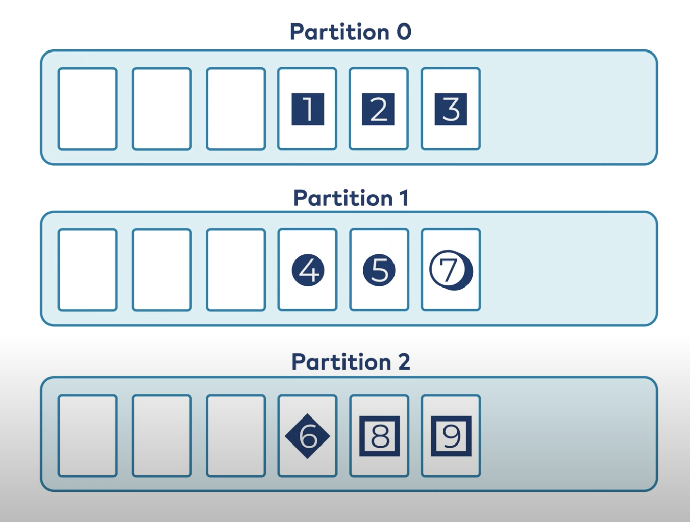
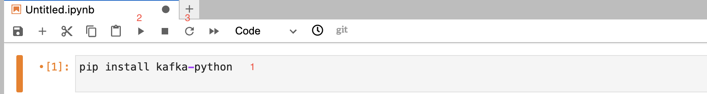

## Topics

### Topics explained

Think of a topic like a table in a database.

You create topics to fold different kinds of events. You wouldn't put different types of events in the same 
topic.

You can also take raw events in one topic, filter the data
into another topic, then transform it into a third topic
that is good practice.

Remember most of the time you will be interacting with topics
using a programming language or framework, for example Python
or spark.

People will often describe Kafka as a queue, but technically it's a log, logs are append only, you can't stick a message in the middle
of a kafka queue.

They are also not indexed, so generally you'll specify the option when reading to start from the beginning or start from the latest offset, or go to an offset and read from there.

Messages last as long as they've been configured to, based on age, size of topic or are set to just never expire.

### Partitioning

One of the main reasons that Kafka is so popular is how it handles scaling, which in the age of big data and realtime data is extremely important.

If you think of a queue being an ordered list dividing this up into pieces can be tricky as you want to retain the ordering.
When you configure the number of partitions, Kafka replicates the topic/log to different nodes in your cluster so you can scale out.

Now all the messages are not replicated, each partition get's different messages.

Kafka takes care of which partitions you read from when you pull the data.
___


### Python Kafka

We'll start by just using the kafka-python library.

As with all of this module we'll be using our Jupyter notebook:

```python
http://localhost:8888/
```

I'll take a screenshot but here are the steps:

1. 
``
pip install kafka-python
``

2. Run the command.

3. Restart the kernel.



With Docker compose running in the background it will have launched a Kafka Cluster now our Jupyter notebook can interact with it.

### Creating a topic

Creating a topic can be done in a few different ways, in a work environment
the creation will be locked down and you'd need sign off from multiply people
to deploy a new topic and it will be done though some kind of CI/CD pipeline.

Another way would be to connect to the Kafka cluster and run bash scripts, after
installing Kafka it leaves a few useful scripts for you locally on the server
to interact with.

This is just an example, don't try the below just read along:

1. Use the kafka-topics.sh script (or kafka-topics.bat for Windows) 
to create a topic. The command syntax is as follows:

```bash
./kafka-topics.sh --create --topic <topic-name> --bootstrap-server <bootstrap-server> --partitions <num-partitions> --replication-factor <replication-factor>
```
- <topic-name>: Specify the name of the topic you want to create.
- <bootstrap-server>: Provide the Kafka bootstrap server(s) in the format <hostname>:<port>.
This is used to connect to the Kafka cluster.
- <num-partitions>: Set the desired number of partitions for the topic. Partitions allow for 
parallelism and scalability.
- <replication-factor>: Determine the replication factor for the topic, i.e., the number of replicas 
of each partition. It ensures fault tolerance.
For example, to create a topic named "my-topic" with 3 partitions and a replication factor of 2, you 
can use the following command:

```bash
./kafka-topics.sh --create --topic my-topic --bootstrap-server localhost:9092 --partitions 3 --replication-factor 2
```

### Creating topics with Python

We'll be using the Confluent API we installed previously to create our topic.


Follow along this time running the code.

```python
import kafka
consumer = kafka.KafkaConsumer(group_id='test', bootstrap_servers=['localhost:9092'])
consumer.topics()
```

This command should return an empty set, basically nothing because we haven't
created a topic yet, so let's do that next.

```python
from kafka.admin import KafkaAdminClient, NewTopic


admin_client = KafkaAdminClient(
    bootstrap_servers="kafka:9092", 
    client_id='test'
)

topic_list = []
topic_list.append(NewTopic(name="example_topic", num_partitions=1, replication_factor=1))
admin_client.create_topics(new_topics=topic_list, validate_only=False)
```
Then let's run our previous now and it should return our topic name. 

We should see this output returned: 

``` zsh
CreateTopicsResponse_v3(throttle_time_ms=0, topic_errors=[(topic='example_topic', error_code=0, error_message=None)])
```

And now we have a topic we can play with. If you try to run this once more, Kafka will tell you this topic has already been created.

So far we've learnt about topics, these abstractions that can be partitioned, the whole data, and we can poll them for new data. 

Now let's move on to sending and receiving data.


<!-- BEGIN GENERATED SECTION DO NOT EDIT -->

---

**How was this resource?**  
[😫](https://airtable.com/shrUJ3t7KLMqVRFKR?prefill_Repository=makersacademy%2Fdata_streaming&prefill_File=02_kafka%2F05_topics.md&prefill_Sentiment=😫) [😕](https://airtable.com/shrUJ3t7KLMqVRFKR?prefill_Repository=makersacademy%2Fdata_streaming&prefill_File=02_kafka%2F05_topics.md&prefill_Sentiment=😕) [😐](https://airtable.com/shrUJ3t7KLMqVRFKR?prefill_Repository=makersacademy%2Fdata_streaming&prefill_File=02_kafka%2F05_topics.md&prefill_Sentiment=😐) [🙂](https://airtable.com/shrUJ3t7KLMqVRFKR?prefill_Repository=makersacademy%2Fdata_streaming&prefill_File=02_kafka%2F05_topics.md&prefill_Sentiment=🙂) [😀](https://airtable.com/shrUJ3t7KLMqVRFKR?prefill_Repository=makersacademy%2Fdata_streaming&prefill_File=02_kafka%2F05_topics.md&prefill_Sentiment=😀)  
Click an emoji to tell us.

<!-- END GENERATED SECTION DO NOT EDIT -->
