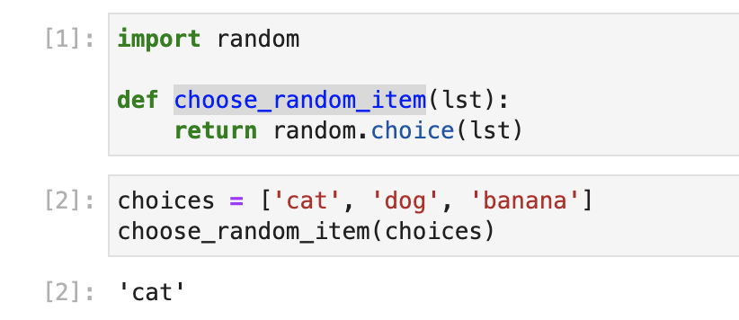

## Python Functions

In a professional environment you'd expect not just to organise your code
using reusable functions but also classes. In practice I've been at small
companies that create libraries that are shared to speed up creating Spark
jobs from scratch, that are well tested and maintained, and I've worked
at one of the largest companies in the world where the team just created
simple untested Python scripts to run their ETL.
For us we'll start out creating functions in our Jupyter notebooks.

### Randomness

Randomness in Python refers to the generation of random numbers or selection 
of random elements from a given set of options. The Python standard library 
provides the `random` module, which offers various functions for working with 
random values.

The `random` module uses pseudorandom number generators (PRNGs) to produce 
random numbers. PRNGs are algorithms that generate a sequence of numbers that
appear random but are actually determined by an initial seed value. By default,
the `random` module uses the system time as the seed value, ensuring that each 
program run produces a different sequence of random numbers.

Here are some commonly used functions from the `random` module:

1. `random.random()`: Returns a random floating-point number between 0 and 1.
2. `random.randint(a, b)`: Returns a random integer between `a` and `b` (inclusive).
3. `random.choice(seq)`: Returns a random element from the given sequence `seq`.
4. `random.shuffle(seq)`: Shuffles the elements of the given sequence `seq` in place.
5. `random.sample(population, k)`: Returns a random sample of `k` elements from the 
6. `population` sequence without replacement.

By using these functions, you can introduce randomness into your Python programs. 
It is important to note that the generated random numbers are not truly random but 
rather pseudorandom, as they are determined by the initial seed value.

Here's an example of a function that takes a list and return a random value:



#### Challenge One
Now if you can do the same and also create one that takes two integers and returns
a random int between the two you passed in.

### Generating Data Part One

Now we know how to create some random values to play with, start put it in a 
loop to simulate events.

Now there are two types of loops we want to simulate, an infinite loop,
that will send a message every second or so until we tell it to stop
and a loop that will run n number of times, for example sending 100 events.

I'll show an example of an infinite loop for you to try out, however be ready
to press the stop button at the top.

```python
import time
from datetime import datetime

# Loop to create one fake event per second
while True:

# Get the current timestamp
    timestamp = datetime.now()

# Print the timestamp
    print("Current timestamp:", timestamp)

    # Wait for one second
    time.sleep(1)
```

## Assessment

Create code to send 20 events with the current timestamp, then send it to your
coach for review.
Going forward try to keep your functions in a cell at the top of your workbook 
so you can reference them when needed in your code. Save frequently.

<!-- OMITTED -->

[Next Challenge](02_spark_practice.md)

<!-- BEGIN GENERATED SECTION DO NOT EDIT -->

---

**How was this resource?**  
[😫](https://airtable.com/shrUJ3t7KLMqVRFKR?prefill_Repository=makersacademy%2Fdata_streaming&prefill_File=03_spark_streaming%2F01_python_practice.md&prefill_Sentiment=😫) [😕](https://airtable.com/shrUJ3t7KLMqVRFKR?prefill_Repository=makersacademy%2Fdata_streaming&prefill_File=03_spark_streaming%2F01_python_practice.md&prefill_Sentiment=😕) [😐](https://airtable.com/shrUJ3t7KLMqVRFKR?prefill_Repository=makersacademy%2Fdata_streaming&prefill_File=03_spark_streaming%2F01_python_practice.md&prefill_Sentiment=😐) [🙂](https://airtable.com/shrUJ3t7KLMqVRFKR?prefill_Repository=makersacademy%2Fdata_streaming&prefill_File=03_spark_streaming%2F01_python_practice.md&prefill_Sentiment=🙂) [😀](https://airtable.com/shrUJ3t7KLMqVRFKR?prefill_Repository=makersacademy%2Fdata_streaming&prefill_File=03_spark_streaming%2F01_python_practice.md&prefill_Sentiment=😀)  
Click an emoji to tell us.

<!-- END GENERATED SECTION DO NOT EDIT -->
