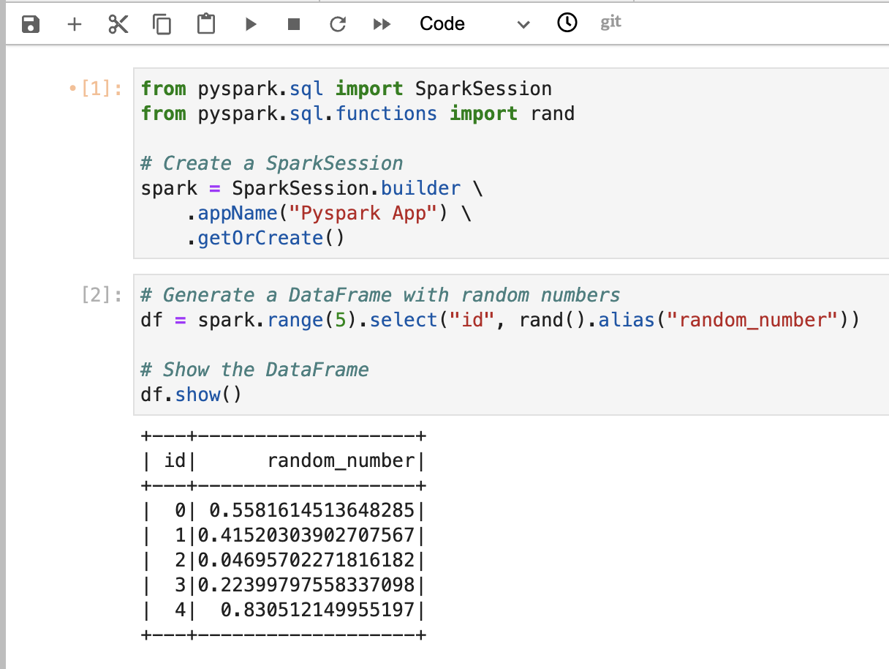
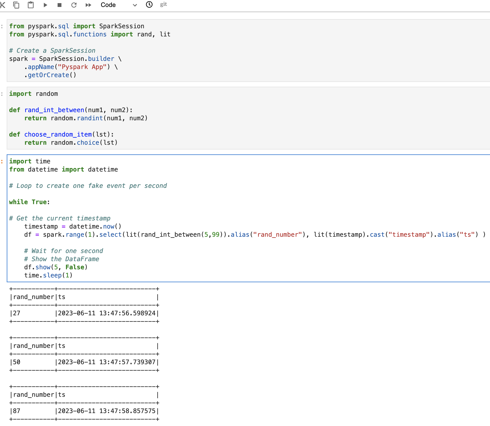
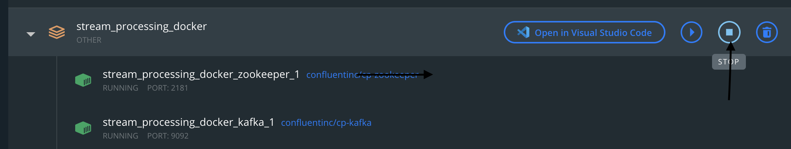

## PySpark Practice

Now let's add PySpark, think of it the same way that you added a function,
at the top add the SparkSession then use it when needed below.



If you can see from the picture if you start a SparkSession at the top
you can then use the spark variable in the rest of the workbook and
generally running the SparkSession twice will cause an error.

### Reusing our functions in PySpark

Now we have some Python code let's plug it into PySpark.

One of the handy built-in functions that we can import into
Spark is called lit.

In PySpark, the lit() function is used to create a literal value or constant column.
It is a function from the pyspark.sql.functions module. The lit() function allows
you to create a column with a fixed value that is the same for all rows in a DataFrame.




## Challenge One

Replicate the code above but change it to send 20 messages, one message
every 5 seconds.

## PySpark and Kafka


Let's create a new topic to play with.
As a warning you might get NoBrokersAvailable: NoBrokersAvailable error message,
it's easier to stop your docker setup and start it up again, should fix
it straight away if you come across it. Example screenshot of stopping docker.


```python
from kafka.admin import KafkaAdminClient, NewTopic


admin_client = KafkaAdminClient(
    bootstrap_servers="kafka:9092", 
    client_id='test'
)

topic_list = []
topic_list.append(NewTopic(name="events_topic", num_partitions=1, replication_factor=1))
admin_client.create_topics(new_topics=topic_list, validate_only=False)
```

Right now that we have a new topic called events_topics let's write to it.

We've done this before in Python now let's try Python/Spark.

```Python
from pyspark.sql import SparkSession

spark = SparkSession.builder.appName("WriteToTopic") \
.config("spark.jars","work/commons-pool2-2.11.1.jar,work/spark-sql-kafka-0-10_2.12-3.4.0.jar,work/spark-streaming-kafka-0-10-assembly_2.12-3.4.0.jar").getOrCreate()

for i in range(1, 11):
    # Create a DataFrame with the current message
    message = f"message {i}"
    data = [(message,),]
    df = spark.createDataFrame(data, ["value"])
    df.show()
    # Write the DataFrame to Kafka
    df.write \
        .format("kafka") \
        .option("kafka.bootstrap.servers", "kafka:9092") \
        .option("topic", "events_topic") \
        .save()
```

Now let's go through this a piece at a time.

```python
from pyspark.sql import SparkSession

```

You'll need some imports such as SparkSession to start PySpark and you should in general try
your best to just import what you need, but I'm terrible for adding more and forgetting, you can get
plugin for removing unwanted imports, you may come across these in your day to day.

```python
spark = SparkSession.builder.appName("WriteToTopic") \
.config("spark.jars","commons-pool2-2.11.1.jar,spark-sql-kafka-0-10_2.12-3.4.0.jar,spark-streaming-kafka-0-10-assembly_2.12-3.4.0.jar").getOrCreate()

```

The next piece we'll see a lot, it's starting a SparkSession, the line below is pretty important and a slight
nightmare to get to work. These are all the 3rd party code from outside of Spark that you'll need
to import to get PySpark working with Kafka. There are many ways to import them, but here we drop them
into your working directory and point to them.

```python
# Here we create a loop where i is 1 to 11.
for i in range(1, 11):
    #Create a string called message with the varible i inside
    message = f"message {i}"
    # Create a list, Spark will treat this as rows, here we just make one row
    data = [(message,),]
    # Create a DataFrame with our data in a field called value
    df = spark.createDataFrame(data, ["value"])
    # Show the DataFrame on each loop just to check our output, you wouldn't do this in production
    df.show()
    # Write the DataFrame to Kafka
    df.write
        .format("kafka")
        .option("kafka.bootstrap.servers", "kafka:9092")
        .option("topic", "events_topic")
        .save()
```

So I've annotated the above the big takeaway is how simple PySpark framework can be at times and also
remember we said that Spark was lazy, and doesn't do any calculations until it has to, calling .show()
on a DataFrame would force it to calculate and compute everything, so you wouldn't do this in 
production code.

So we have a topic, written to it, now the trickier stuff, let's stream from it.


[Next Challenge](03_start_streaming.md)

<!-- BEGIN GENERATED SECTION DO NOT EDIT -->

---

**How was this resource?**  
[😫](https://airtable.com/shrUJ3t7KLMqVRFKR?prefill_Repository=makersacademy%2Fdata_streaming&prefill_File=03_spark_streaming%2F02_spark_practice.md&prefill_Sentiment=😫) [😕](https://airtable.com/shrUJ3t7KLMqVRFKR?prefill_Repository=makersacademy%2Fdata_streaming&prefill_File=03_spark_streaming%2F02_spark_practice.md&prefill_Sentiment=😕) [😐](https://airtable.com/shrUJ3t7KLMqVRFKR?prefill_Repository=makersacademy%2Fdata_streaming&prefill_File=03_spark_streaming%2F02_spark_practice.md&prefill_Sentiment=😐) [🙂](https://airtable.com/shrUJ3t7KLMqVRFKR?prefill_Repository=makersacademy%2Fdata_streaming&prefill_File=03_spark_streaming%2F02_spark_practice.md&prefill_Sentiment=🙂) [😀](https://airtable.com/shrUJ3t7KLMqVRFKR?prefill_Repository=makersacademy%2Fdata_streaming&prefill_File=03_spark_streaming%2F02_spark_practice.md&prefill_Sentiment=😀)  
Click an emoji to tell us.

<!-- END GENERATED SECTION DO NOT EDIT -->
