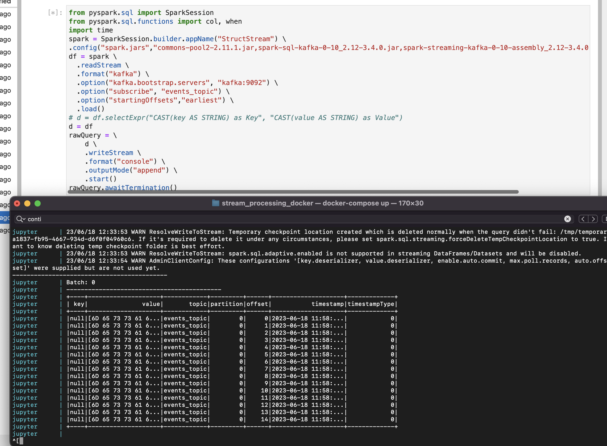
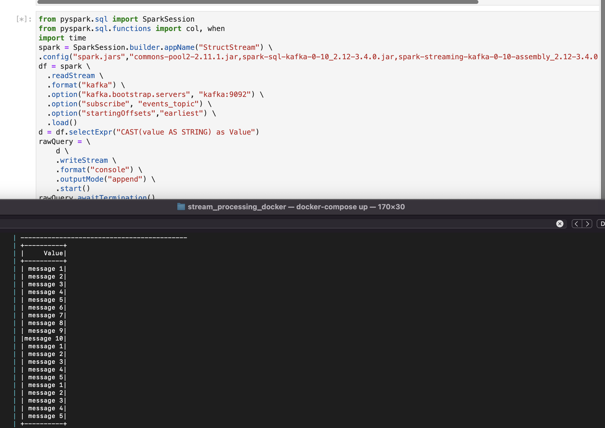
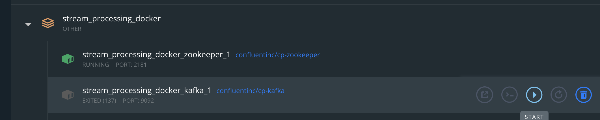
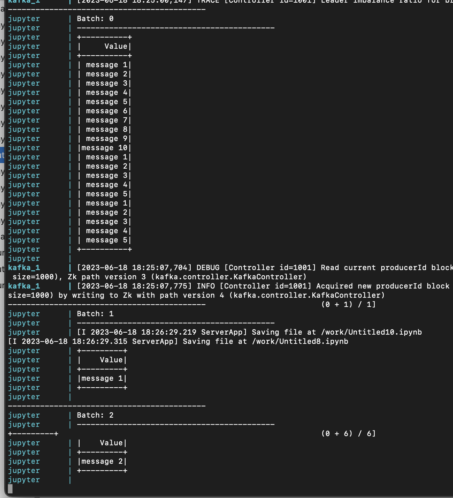

## Spark Streaming

In this section we'll talk about the basics of Spark streaming and go through some examples.

## DStreams
Spark DStreams (Discretized Streams) is the fundamental abstraction in Apache Spark Streaming, 
which is the streaming module of Apache Spark. DStreams represent a continuous stream of data divided into small,
small batches.
It's important to think about all Spark streams as batches and the fact that Spark is never truly real time,
because it does what people call micro batch, although in reality we are talking a second or so.
DStreams provides a high-level programming interface for processing real-time streaming data using 
the same programming model as batch processing in Spark.

DStreams in Spark Streaming are built on top of RDDs (Resilient Distributed Datasets), 
which are the core data abstraction in Apache Spark. DStreams are created by ingesting data from 
various sources such as Kafka, Flume, HDFS, socket streams, etc. They can also be derived from 
other DStreams or RDDs through transformations.

DStreams support two types of operations:

- Transformations: DStreams provide various transformation operations similar to those in RDDs, 
such as map, filter, reduceByKey, join, etc. These transformations enable data manipulation 
and processing on the stream of data.

- Output Operations: DStreams support output operations like print, saveAsTextFiles, foreachRDD, etc.
These operations allow you to output the computed results of the DStreams to external systems or 
perform actions on each RDD within the DStream.

DStreams in Spark Streaming provide fault-tolerance by leveraging the RDD lineage and storing the 
necessary metadata to recover data in case of failures. This enables exactly-once semantics and reliable 
processing of streaming data.

Spark DStreams offer a convenient and powerful way to process and analyse real-time streaming data using 
familiar Spark programming constructs. They provide a scalable and fault-tolerant solution for building 
real-time streaming applications.

### Structured Streaming

We are actually going to skip over DStreams because they're becoming legacy, they use RDDs
and the more functional programming style API whereas structured streaming makes it simple
to stream and create aggregations and work with an in memory table which we'll look at.


PySpark structured streaming is a high-level API in Apache Spark that allows you to process real-time 
streaming data using the same programming model as batch processing. It provides a declarative and SQL-like 
interface for defining streaming computations and seamlessly integrates with the Spark SQL engine.

Here are some key concepts and features of PySpark structured streaming:

- DataFrame-based API: Structured streaming in PySpark operates on DataFrames, which are distributed collections 
of structured data with a schema. DataFrames provide a tabular representation of the streaming data, allowing 
you to apply SQL-like operations and transformations.

- Event-time processing: Structured streaming supports event-time processing, which means you can associate 
timestamps with events and perform operations based on event timestamps rather than processing time. 
This enables more accurate and reliable stream processing.

- Sources and sinks: PySpark structured streaming provides built-in connectors for various streaming sources like Kafka,
file systems, socket streams, etc. Similarly, it supports different output sinks like files, databases, message queues,
and more. You can easily connect to these sources and sinks to read and write streaming data.

- Window operations: You can perform window operations on streaming DataFrames, allowing you to define 
time-based windows to group and aggregate data. Window functions provide operations like sliding windows, 
tumbling windows, and session windows for advanced stream processing.

- Fault-tolerance and reliability: Structured streaming in PySpark provides fault-tolerant processing of 
streaming data by ensuring end-to-end reliability. It supports checkpointing, which saves the streaming state
to a reliable storage system like HDFS, allowing the system to recover from failures and continue processing 
from where it left off.

- Continuous processing: PySpark structured streaming also introduces continuous processing mode, where the data
is processed in a low-latency, continuous manner rather than in micro-batches. This mode is suitable for 
scenarios that require sub-millisecond latency and near real-time processing. We didn't quite lie
about micro batching as this feature is marked as experimental.

By leveraging PySpark structured streaming, you can build scalable, fault-tolerant, and real-time streaming
applications using familiar SQL-like operations and the powerful distributed computing capabilities of Apache Spark.

### Gotchas

Using a self-hosted Kafka setup can be a bit brittle and break easy. In fact in a previous role I inherited
a Java Spring Boot streaming process that read from Kafka. 
The flow would be that an event came in from Kafka and as soon as we took the message we'd trigger
an SQL query and that query could take an hour or two, at which point Kafka wouldn't have
received a heart beat from us and would disconnect and it would take an hour to reconnect because
the timeout was set to max, and that was to stop us disconnecting but in the end also
stopped us re-connecting.

With that said, I've also faced many small issues while checking all the examples in this module, in the end 
I'd either stop docker and start it again from the command line or reboot the kernel a couple of times.
Also good to check that Kafka is running if you are getting a DNS error, simply opening the docker
UI and starting it is fine.
Also good to be aware of this as we aren't writing production code, just practising and getting used to
streaming with Kafka.

### Spark Structured streaming examples

We'll do what we've done before, show some streaming code, then dive into what it means, then try
ourselves and take it to the next level with some bespoke code.



Before you get into the code you can see from the picture we are using
Jupyter notebook to read from Kafka and write to the console, which is when we bring up
the console we used to launch docker and we can see the output.

```python
# Usual comments
from pyspark.sql import SparkSession

# Creating a SparkSession with the extra jars we need for Kafka
spark = SparkSession.builder.appName("StructStream").config("spark.jars","work/data/commons-pool2-2.11.1.jar,work/data/spark-sql-kafka-0-10_2.12-3.4.0.jar,work/data/spark-streaming-kafka-0-10-assembly_2.12-3.4.0.jar").getOrCreate()

# Read Kafka as a stream, you can read it as a batch also.  Simple read everything
# on the topic into one DataFrame going back to the beginning
df = spark.readStream.format("kafka").option("kafka.bootstrap.servers", "kafka:9092").option("subscribe", "events_topic").option("startingOffsets","earliest").load()

# Commented out code which would make the output more readable
# df = df.selectExpr("CAST(key AS STRING) as Key", "CAST(value AS STRING) as Value")

df = df.selectExpr("CAST(value AS STRING) as Value")
# Here we take the previous stream from Kafka and write that stream to the console 
rawQuery = df.writeStream.format("console").outputMode("append").start()


# Once you start the stream you either end it or keep it listening for more data with
# the awaitTermination option
rawQuery.awaitTermination()


```

If you didn't use the terminal to run `docker compose up`, and are having trouble seeing the `console`  output, head to the Jupyter Logs in the Docker Container. You can view them there.

Now if you run all the examples hopefully you'll get the same output from the screenshot above,
notice how the value is a byte area and not very useful, let's try to fix that with another example.

When you start a stream and want to make a change you'll have to restart the kernel because that process is
listening and a change can't be made without stopping that.



Now if we add this line of code you can see the data nicely.

```python
d = df.selectExpr("CAST(value AS STRING) as Value")
```

### Challenge

Let's take it to the next level. Make sure you've restarted docker and have no processing running.

Then create two tabs.

In one tab just put the code that writes to Kafka, then in the other tab put our example above.

Start our example above then start the tab that just writes to Kafka, you should
see a big lump of data come in followed by batches.



When starting and stopping services check that Kafka is running.



When you get that working you'll notice the batches come in, the first batch is the 
whole Kafka topic then the following are the new events you are generating.

[Next Challenge](04_more_streaming.md)

<!-- BEGIN GENERATED SECTION DO NOT EDIT -->

---

**How was this resource?**  
[😫](https://airtable.com/shrUJ3t7KLMqVRFKR?prefill_Repository=makersacademy%2Fdata_streaming&prefill_File=03_spark_streaming%2F03_start_streaming.md&prefill_Sentiment=😫) [😕](https://airtable.com/shrUJ3t7KLMqVRFKR?prefill_Repository=makersacademy%2Fdata_streaming&prefill_File=03_spark_streaming%2F03_start_streaming.md&prefill_Sentiment=😕) [😐](https://airtable.com/shrUJ3t7KLMqVRFKR?prefill_Repository=makersacademy%2Fdata_streaming&prefill_File=03_spark_streaming%2F03_start_streaming.md&prefill_Sentiment=😐) [🙂](https://airtable.com/shrUJ3t7KLMqVRFKR?prefill_Repository=makersacademy%2Fdata_streaming&prefill_File=03_spark_streaming%2F03_start_streaming.md&prefill_Sentiment=🙂) [😀](https://airtable.com/shrUJ3t7KLMqVRFKR?prefill_Repository=makersacademy%2Fdata_streaming&prefill_File=03_spark_streaming%2F03_start_streaming.md&prefill_Sentiment=😀)  
Click an emoji to tell us.

<!-- END GENERATED SECTION DO NOT EDIT -->
