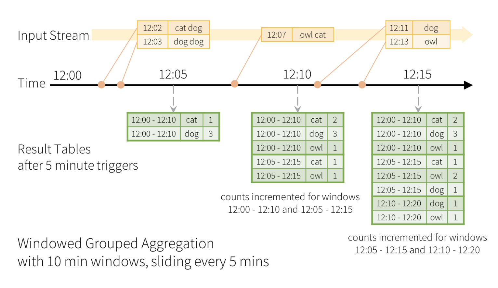

## Structured Streaming 

Before we talked about why you'd want to use Structured streaming and a summary of features
and we've run the code and got some output, so now we have the context to talk about
what is going on.

### Table

Table is the key word here, the programming model for Spark Structured streaming is to 
thinking of the stream as data being appended to a table.
Then we do something with that table, we can sum data and aggregate the data or even
join it, then another table is generated, known as the result table.
Then when new events come in they get added to the results table depending on your
trigger interval, we'll get into that shortly.
Then again the output is generated.

### Triggers 

In Spark Structured Streaming, trigger intervals determine how frequently the
streaming query is executed and processed. It controls the rate at which the 
streaming data is ingested and processed by defining when the next batch of data is processed.

There are two types of trigger intervals available in Spark Structured Streaming:

1. Processing Time Trigger: With processing time trigger, the next batch of data 
is processed based on a fixed interval of time. You specify the interval using 
the `trigger` method. 
For example, `trigger(processingTime='5 seconds')` sets the trigger interval 
to 5 seconds. This means that Spark will attempt to process data every 5 seconds, 
regardless of the arrival of new data.

2. Event Time Trigger: Event time trigger allows you to process data based on event timestamps.
Event time is the timestamp associated with each individual event in the data stream. 
The trigger interval is dynamically determined based on the event timestamps. 
You can specify the trigger interval using the `trigger` method with 
`triggerType='eventTime'` and optionally provide a watermark and a delay threshold.
The watermark helps determine the event time window for processing, while the delay 
threshold defines the maximum delay allowed for late events.

When using trigger intervals, it's important to consider the trade-off between 
latency and throughput. Smaller trigger intervals result in lower latency but 
higher overhead due to more frequent processing, whereas larger trigger intervals 
increase latency but reduce overhead. The appropriate choice of trigger interval 
depends on the specific requirements of your application.

Note that Spark Structured Streaming supports other advanced triggering mechanisms 
as well, such as `continuous` mode for low-latency processing and `once` mode for 
one-time batch processing. These modes provide more control and flexibility for 
different streaming use cases.

Overall, trigger intervals play a crucial role in determining the processing frequency 
and latency characteristics of Spark Structured Streaming applications, allowing you to
balance the trade-off between responsiveness and resource utilization.

Adding the below line to the code will create an interval.
```python
# Default trigger (runs micro-batch as soon as it can)
df.writeStream
    .format("console")
    .start()

# ProcessingTime trigger with two-seconds micro-batch interval
df.writeStream
    .format("console")
    .trigger(processingTime='2 seconds')
    .start()

# One-time trigger (Deprecated, encouraged to use Available-now trigger)
df.writeStream
    .format("console")
    .trigger(once=True)
    .start()

# Available-now trigger
df.writeStream
    .format("console")
    .trigger(availableNow=True)
    .start()

# Continuous trigger with one-second checkpointing interval
df.writeStream
.format("console")
.trigger(continuous='1 second')
.start()
```

### Windowing

For me by far the trickiest concept to understand and reason about is streaming
windowing.
At a basic level you can aggregate the data coming in based on an event date and
calculate the result table based on a time you've defined.

Let's look at the example from the Spark website.

Here is the code they'd used as an example, it's a small snippet that
shows a groupBy, then a window being defined, then the settings `"10 minutes"`
and `"5 minutes"`. Which mean do the groupings in 10 min batches then slide every 5 minutes :

```python
# Group the data by window and word and compute the count of each group
windowedCounts = words.groupBy(
    window(words.timestamp, "10 minutes", "5 minutes"),
    words.word
).count()
```


 
> Instead of running word counts, we want to count words within 10 minute windows, updating 
> every 5 minutes. That is, word counts in words received between 10 minute windows 12:00 -
> 12:10, 12:05 - 12:15, 12:10 - 12:20, etc. Note that 12:00 - 12:10 means data that arrived 
> after 12:00 but before 12:10. Now, consider a word that was received at 12:07. This word 
> should increment the counts corresponding to two windows 12:00 - 12:10 and 12:05 - 12:15. 
> So the counts will be indexed by both, the grouping key (i.e. the word) and the window 
> (can be calculated from the event-time).
The result tables would look something like the following.


### Late arriving data and watermarking

Now if data was to arrive at 12:15 but had the timestamp 12:01 it would go into the 12:00
to 12:10 group correctly.
Now the thing to think about is what happens if this runs for a year, how much data do you 
think you can fit in memory, imagine after a year a user turns their phone on and a year 
old event comes in, it would have to scan to the start, but it wouldn't fit in memory.
So we have `watermark`, you can set a watermark and it will ignore data which is older
than it.

```python
windowedCounts = words \
    .withWatermark("timestamp", "10 minutes") \
    .groupBy(
        window(words.timestamp, "10 minutes", "5 minutes"),
        words.word) \
    .count()
```

[Next Challenge](05_json_input_output.md)

<!-- BEGIN GENERATED SECTION DO NOT EDIT -->

---

**How was this resource?**  
[😫](https://airtable.com/shrUJ3t7KLMqVRFKR?prefill_Repository=makersacademy%2Fdata_streaming&prefill_File=03_spark_streaming%2F04_more_streaming.md&prefill_Sentiment=😫) [😕](https://airtable.com/shrUJ3t7KLMqVRFKR?prefill_Repository=makersacademy%2Fdata_streaming&prefill_File=03_spark_streaming%2F04_more_streaming.md&prefill_Sentiment=😕) [😐](https://airtable.com/shrUJ3t7KLMqVRFKR?prefill_Repository=makersacademy%2Fdata_streaming&prefill_File=03_spark_streaming%2F04_more_streaming.md&prefill_Sentiment=😐) [🙂](https://airtable.com/shrUJ3t7KLMqVRFKR?prefill_Repository=makersacademy%2Fdata_streaming&prefill_File=03_spark_streaming%2F04_more_streaming.md&prefill_Sentiment=🙂) [😀](https://airtable.com/shrUJ3t7KLMqVRFKR?prefill_Repository=makersacademy%2Fdata_streaming&prefill_File=03_spark_streaming%2F04_more_streaming.md&prefill_Sentiment=😀)  
Click an emoji to tell us.

<!-- END GENERATED SECTION DO NOT EDIT -->
